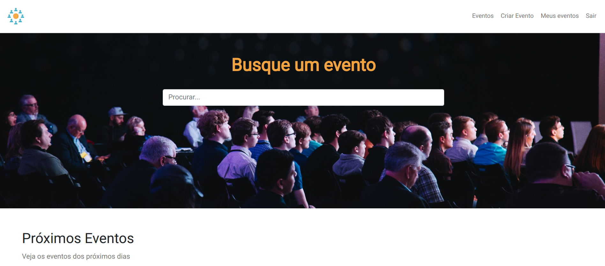
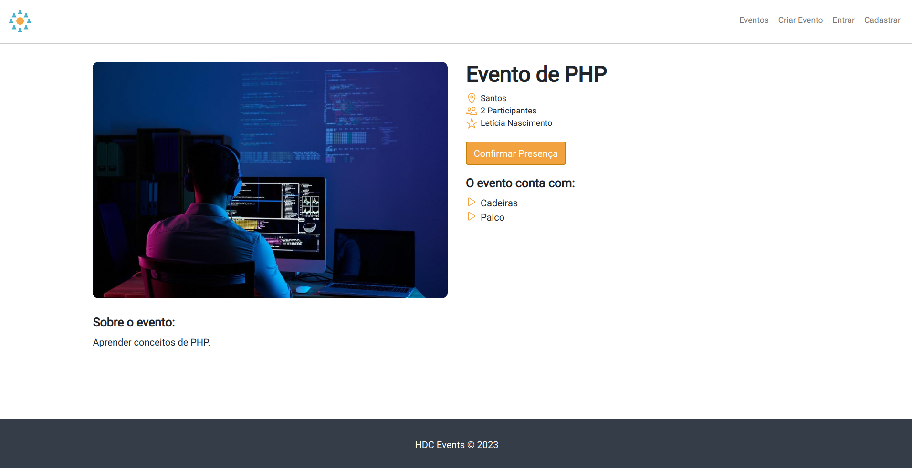
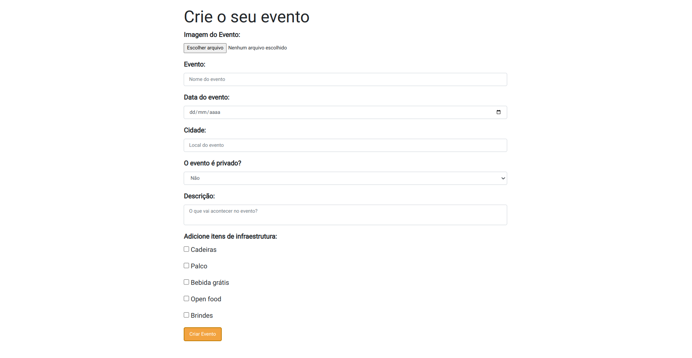
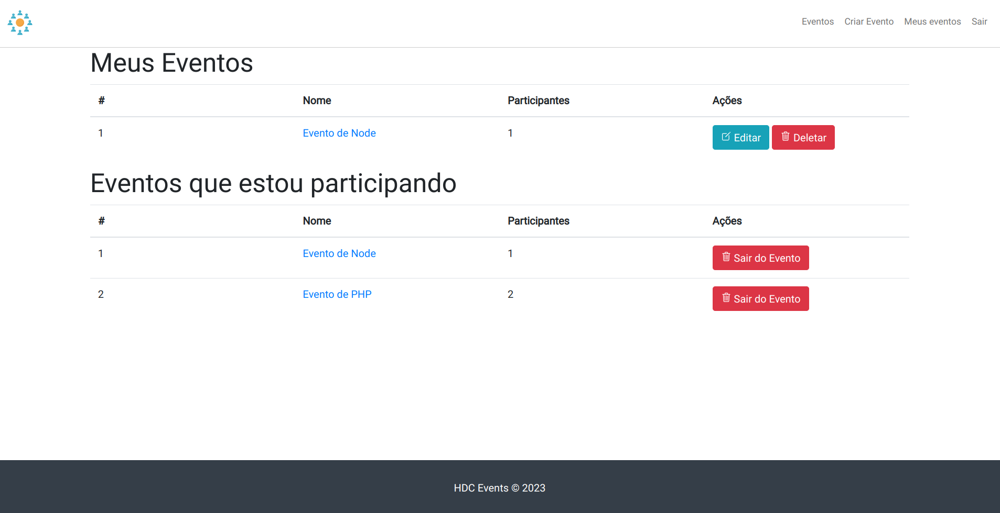

  <a href="#-tecnologias">Tecnologias</a>&nbsp;&nbsp;&nbsp;|&nbsp;&nbsp;&nbsp;
  <a href="#-projeto">Projeto</a>&nbsp;&nbsp;&nbsp;|&nbsp;&nbsp;&nbsp;
  <a href="#-como-rodar">Como rodar</a>&nbsp;&nbsp;&nbsp;|&nbsp;&nbsp;&nbsp;
  <a href="#-como-contribuir">Como contribuir</a>&nbsp;&nbsp;&nbsp;
  

 

  

  

  

  

  

## Events Page

## 🚀 Tecnologias

Esse projeto foi desenvolvido com as seguintes tecnologias:

- [Laravel](https://laravel.com/)
- [Composer](https://getcomposer.org/) - 2.4.4
- [Jetstream](https://jetstream.laravel.com/2.x/introduction.html)

## 💻 Projeto

Projeto de uma página de criação de eventos desenvolvido com Laravel.

Aula do canal [Matheus Battisti](https://www.youtube.com/playlist?list=PLnDvRpP8BnewYKI1n2chQrrR4EYiJKbUG)

## 🚀 Como Rodar

- Clone o projeto;
- Crie um arquivo chamado '.env' e copie tudo o que está no '.env.example';
- Configure o username e password do arquivo '.env' com os dados do seu banco de dados (DB_DATABASE=hdceventscurso);
- php artisan serve (roda o projeto na porta indicada);

Obs: sem a configuração do banco de dados o projeto não irá rodar.

## 🤔 Como contribuir

- Faça um fork desse repositório;
- Cria uma branch com a sua feature: `git checkout -b minha-feature`;
- Faça commit das suas alterações: `git commit -m 'feat: Minha nova feature'`;
- Faça push para a sua branch: `git push origin minha-feature`.

Depois que o merge da sua pull request for feito, você pode deletar a sua branch.

## 📝 Licença

Esse projeto está sob a licença MIT.
